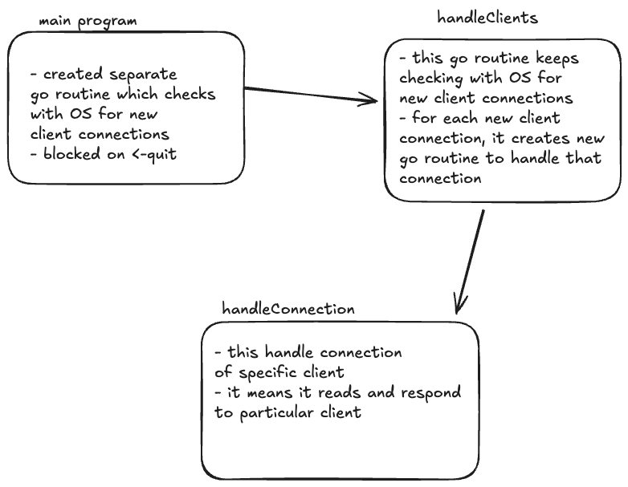

## Our TCP Server

- why we are not using ReadString now? and shifted to scanner
- must remember limitation of using scanner for our server
- we are not using scanner, why?
- shifted to raw bytes
- what should be max allowed key size?
- maybe going back to scanner, why?

### Graceful Shutdown
- our TCP server asks OS for connections on port :8080
- we have separate go routine which asks OS for new connections in a loop
- each new client connection will be handled in a separate go routine
- we have created limit on max how many concurrent connections can exist
- for graceful shutdown we have created separate channel named quit
- this channel gets signals from OS when OS receives INTURRUPTS to stop the program
- our main is blocked by <-quit channel
- as soon as we get signal to stop the program we asks OS to not give us the new connections
- it is done by listener.Close() syntax, this causes err in listener.Accept() since it was waiting for new connection from OS. here OS will say that I can't give you more connection, you are reading from closed network connection
- our clients handling goroutine will return
- now our client specific go routines will still keep reading from client
- as soon as client stops connection we will return from that goroutines as well
- note that in main, program was first blocked on <-quit channel and later it blocked on wg.Wait() to get all connections completed
- once all connections are closed, our program will stop

### Panic Recovery
- since our server is concurrent, many clients will be interacting with our server at once
- we don't want to crash our server if particular client fails (panic situation), (we are assuming our main code is not failing)
- since we are handling each client in it's separate goroutine, we have ability to handle panic recovery inside that go routine only
- we have added recover in the defer statement, so our goroutine get's recovered before crashing entire system

### Read Deadline
- since we have persistent connection with client and OS don't have any hard limit on the time for which we can keep TCP connection alive
- it creates the situation where client can keep connection open without using it for several hours / days
- for that we have added connection ReadDeadline
- that means after every read, if client don't interact with the server again within specified time, we are going to close the connection from server side